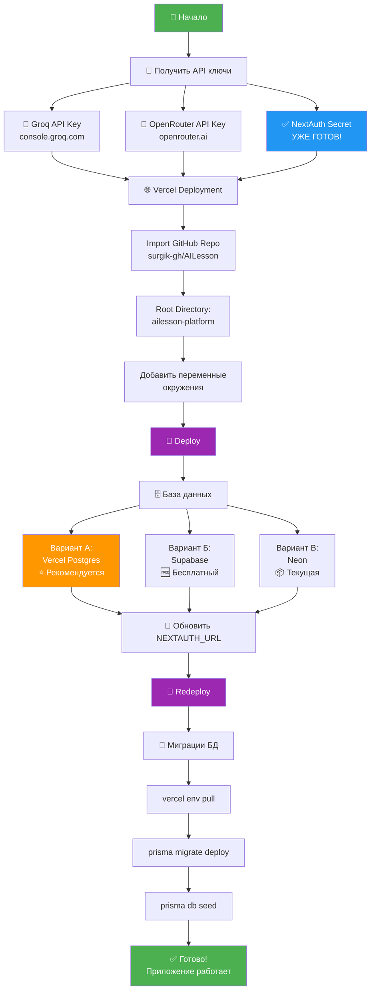
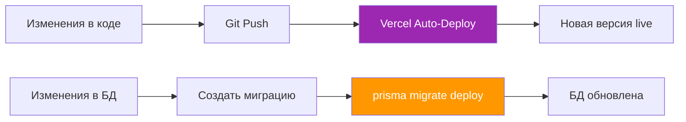

# 🗺️ Схема развертывания AILesson Platform

## Визуальная карта процесса



---

## 📊 Временная шкала

```
┌─────────────────────────────────────────────────────────────┐
│                    Общее время: ~20-30 минут                 │
└─────────────────────────────────────────────────────────────┘

📝 Получение API ключей          [████████░░] 5-10 мин
   ├─ Groq                        [███░░░░░░░] 2 мин
   ├─ OpenRouter                  [███░░░░░░░] 2 мин
   └─ NextAuth Secret             [██████████] ✅ Готов!

🌐 Vercel Deployment              [████████░░] 5-10 мин
   ├─ Import Repository           [██░░░░░░░░] 1 мин
   ├─ Настройка проекта           [███░░░░░░░] 2 мин
   ├─ Переменные окружения        [███░░░░░░░] 2 мин
   └─ Первый деплой               [████░░░░░░] 3 мин

🗄️ База данных                    [████░░░░░░] 2-5 мин
   └─ Vercel Postgres             [████░░░░░░] 2 мин
      (или Supabase)              [█████░░░░░] 3 мин

🔄 Финализация                    [█████░░░░░] 3-5 мин
   ├─ Обновить NEXTAUTH_URL       [██░░░░░░░░] 1 мин
   ├─ Redeploy                    [███░░░░░░░] 2 мин
   └─ Миграции БД                 [████░░░░░░] 2 мин

✅ Тестирование                   [███░░░░░░░] 2 мин
```

---

## 🔑 Карта переменных окружения

```
┌──────────────────────────────────────────────────────────────┐
│                  ПЕРЕМЕННЫЕ ОКРУЖЕНИЯ                         │
└──────────────────────────────────────────────────────────────┘

🔐 Аутентификация
├─ NEXTAUTH_URL ..................... 🌐 URL приложения
│  └─ Источник: Vercel (после деплоя)
│  └─ Пример: https://ailesson-abc123.vercel.app
│
└─ NEXTAUTH_SECRET .................. 🔑 Секретный ключ
   └─ Источник: ✅ УЖЕ ГОТОВ!
   └─ Значение: 3ivwX0knmak41v6l7asbqmkHkkpXUZkdWOOL92CO0HQ=

🗄️ База данных
└─ DATABASE_URL ..................... 🐘 PostgreSQL
   ├─ Вариант А: Vercel Postgres (автоматически)
   ├─ Вариант Б: Supabase (supabase.com)
   └─ Вариант В: Neon (текущая база)

🤖 AI Сервисы
├─ GROQ_API_KEY ..................... 🚀 Генерация уроков
│  └─ Источник: console.groq.com
│  └─ Формат: gsk_...
│
└─ OPENROUTER_API_KEY ............... 🧠 AI эксперты
   └─ Источник: openrouter.ai
   └─ Формат: sk-or-v1-...

⚙️ Конфигурация
├─ CHAT_COST_PER_MESSAGE ............ 💰 Стоимость сообщения
│  └─ Значение: 5
│
├─ MAX_FILE_SIZE_MB ................. 📦 Макс. размер файла
│  └─ Значение: 50
│
└─ ALLOWED_FILE_TYPES ............... 📄 Типы файлов
   └─ Значение: pdf,png,jpg,jpeg,txt
```

---

## 🎯 Критический путь (минимум для запуска)

```
1. NEXTAUTH_SECRET ✅ (готов)
2. GROQ_API_KEY 🚀 (обязательно)
3. OPENROUTER_API_KEY 🤖 (обязательно)
4. DATABASE_URL 🗄️ (обязательно)
5. NEXTAUTH_URL 🌐 (после деплоя)
```

**Без этих переменных приложение не запустится!**

---

## 🔄 Процесс обновления после изменений



---

## 📱 Архитектура развернутого приложения

```
┌─────────────────────────────────────────────────────────────┐
│                         ПОЛЬЗОВАТЕЛЬ                         │
└────────────────────────┬────────────────────────────────────┘
                         │
                         ▼
┌─────────────────────────────────────────────────────────────┐
│                    VERCEL (Edge Network)                     │
│  ┌──────────────────────────────────────────────────────┐   │
│  │              Next.js Application                      │   │
│  │  ┌────────────┐  ┌────────────┐  ┌────────────┐     │   │
│  │  │   Pages    │  │    API     │  │   Static   │     │   │
│  │  │  (React)   │  │   Routes   │  │   Assets   │     │   │
│  │  └────────────┘  └────────────┘  └────────────┘     │   │
│  └──────────────────────────────────────────────────────┘   │
└────────────────────────┬────────────────────────────────────┘
                         │
         ┌───────────────┼───────────────┐
         │               │               │
         ▼               ▼               ▼
┌─────────────┐  ┌─────────────┐  ┌─────────────┐
│  PostgreSQL │  │    Groq     │  │ OpenRouter  │
│   Database  │  │   AI API    │  │   AI API    │
│             │  │             │  │             │
│ (Vercel/    │  │ (Lessons &  │  │ (AI Expert  │
│  Supabase/  │  │   Quizzes)  │  │ Generation) │
│   Neon)     │  │             │  │             │
└─────────────┘  └─────────────┘  └─────────────┘
```

---

## 🎉 Результат

После завершения всех шагов у вас будет:

✅ Работающее приложение на Vercel  
✅ База данных PostgreSQL  
✅ AI-генерация уроков (Groq)  
✅ AI-эксперты (OpenRouter)  
✅ Система аутентификации (NextAuth)  
✅ Автоматические деплои при push в GitHub  

**URL приложения:** `https://ваш-проект.vercel.app`

---

## 📚 Следующие шаги

1. **Custom Domain** - подключите свой домен
2. **Monitoring** - настройте мониторинг ошибок
3. **Analytics** - добавьте аналитику
4. **Backup** - настройте бэкапы БД
5. **CI/CD** - настройте автотесты перед деплоем
